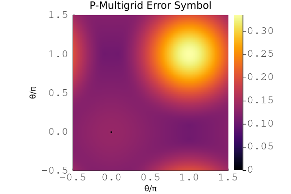
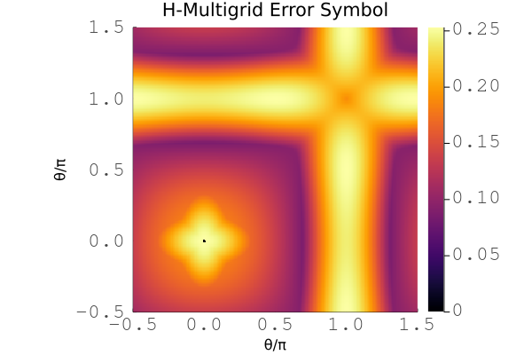
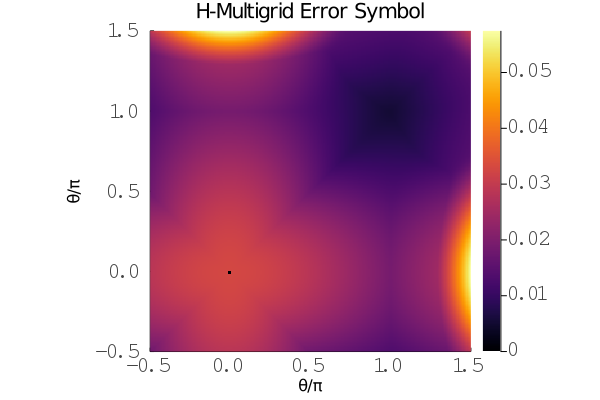

## Diffusion operator

This is an example of various preconditioners for the 2D scalar diffusion problem.

### Problem formulation

The scalar diffusion problem is given by

```math
\nabla^2 u = f
```

with a weak form of

```math
\int_\Omega \nabla u \nabla v = \int_\Omega v f, \forall v \in V
```

for an appropriate test space ``V \subseteq H_0^1 \left( \Omega \right)`` on the domain.
In this weak formulation, boundary terms have been omitted, as they are not present on the infinite grid for Local Fourier Analysis.


Plot for the symbol of the finite element operator for the 2D scalar diffusion problem with cubic basis.

### LFAToolkit code

The diffusion operator is the classical test case for multigrid preconditioners and solvers.

#### Jacobi

This is an example of a Jacobi smoother.

````@eval
using Markdown
Markdown.parse("""
```julia
$(read("../../../examples/ex101_jacobi.jl", String))
```
""")
````


Plot for the symbol of a Jacobi smoother for the 2D scalar diffusion problem with cubic basis.

#### Chebyshev

This is an example of a Chebyshev smoother.

````@eval
using Markdown
Markdown.parse("""
```julia
$(read("../../../examples/ex111_chebyshev.jl", String))
```
""")
````


Plot for the symbol of a cubic Chebyshev smoother for the 2D scalar diffusion problem with cubic basis.

#### P-Multigrid

This is an example of a two level p-multigrid preconditioner.

````@eval
using Markdown
Markdown.parse("""
```julia
$(read("../../../examples/ex201_pmultigrid.jl", String))
```
""")
````


Example plot for the symbol of p-multigrid with a cubic Chebyshev smoother for the 2D scalar diffusion problem with cubic basis.

This is an example of a multilevel p-multigrid preconditioner.

````@eval
using Markdown
Markdown.parse("""
```julia
$(read("../../../examples/ex202_pmultigrid_multilevel.jl", String))
```
""")
````



Example plot for the symbol of multilevel p-multigrid with a cubic Chebyshev smoother for the 2D scalar diffusion problem with cubic basis.

#### H-Multigrid

This is an example of a two level h-multigrid preconditioner.

````@eval
using Markdown
Markdown.parse("""
```julia
$(read("../../../examples/ex211_hmultigrid.jl", String))
```
""")
````



Example plot for the symbol of h-multigrid with a cubic Chebyshev smoother for the 2D scalar diffusion problem with linear basis.

This is an example of a multilevel h-multigrid preconditioner.

````@eval
using Markdown
Markdown.parse("""
```julia
$(read("../../../examples/ex212_hmultigrid_multilevel.jl", String))
```
""")
````



Example plot for the symbol of multilevel h-multigrid with a cubic Chebyshev smoother for the 2D scalar diffusion problem with linear basis.