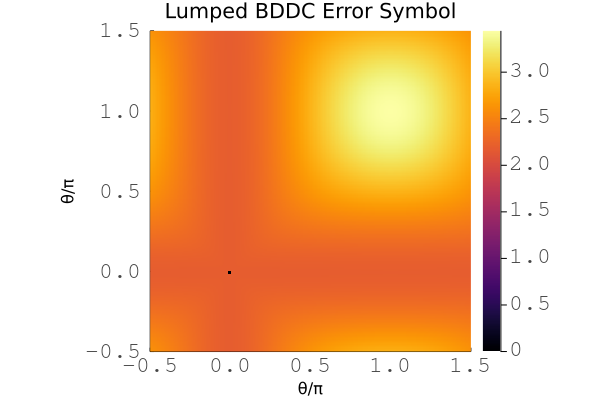

## Preconditioner: BDDC

LFAToolkit supports lumped and Dirichlet BDDC preconditioners.

```@docs
BDDCInjectionType.BDDCInjectType
```

### Lumped BDDC

#### Examples

This is an example of a simple lumped BDDC preconditioner.

````@eval
using Markdown
Markdown.parse("""
```julia
$(read("../../../../examples/ex221_lumped_bddc.jl", String))
```
""")
````


This is an example of a simple lumped BDDC preconditioner on a macro-element patch.

````@eval
using Markdown
Markdown.parse("""
```julia
$(read("../../../../examples/ex222_lumped_bddc.jl", String))
```
""")
````


#### Documentation

```@docs
LumpedBDDC
computesymbols(::BDDC, ::Array{<:Real}, ::Array{<:Real})
```

### Dirichlet BDDC

#### Examples

This is an example of a simple Dirichlet BDDC preconditioner.

````@eval
using Markdown
Markdown.parse("""
```julia
$(read("../../../../examples/ex223_dirichlet_bddc.jl", String))
```
""")
````


This is an example of a simple Dirichlet BDDC preconditioner on a macro-element patch.

````@eval
using Markdown
Markdown.parse("""
```julia
$(read("../../../../examples/ex224_dirichlet_bddc.jl", String))
```
""")
````


#### Documentation

```@docs
DirichletBDDC
```
